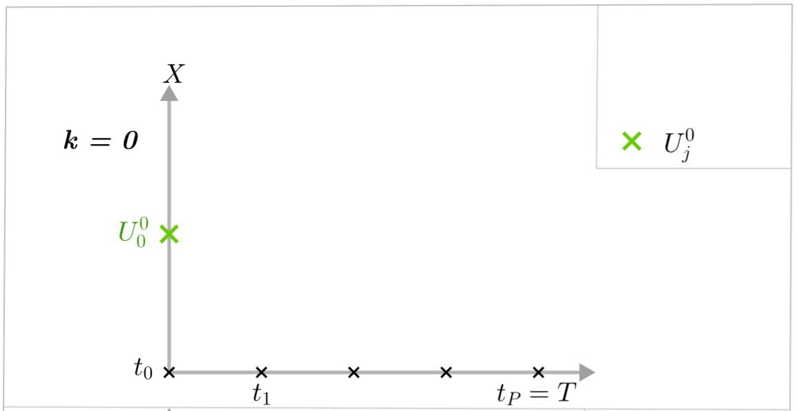

= Parareal method
:stem: latexmath

Para-real method is a parallel-in-time integration method which was introduced in 2001 by Lions, Maday and Turinici (see https://en.wikipedia.org/wiki/Parareal#Parallel-in-time_integration_methods[Parareal]). Parareal computes the numerical solution for multiple time steps in parallel and it is categorized as a parallel-across-the-steps method.

Parareal method needs a decomposition of the time interval stem:[[t_0,T]] into $P$ slices stem:[[t_j,t_{j+1}]] with  stem:[j\in\{0,\dots,P-1\}], where stem:[P] is the number of process units. As we want to parallelize the algorithm, each time slice is assigned to one process.

We denote by stem:[F] an integrator which is of high accuracy and stem:[G] which is of low accuracy. Also, stem:[F] will be very expensive in terms of calculation but very accurate, and stem:[G] will be very cheap but very imprecise. We denote by stem:[\Delta t_F] the time step and by stem:[\Delta t_G] the coarse time step.

We denote by stem:[U_j^k], stem:[j\in\{0,\dots,P\}] the initial point at time stem:[t_j] and at iteration stem:[k]. We also denote stem:[F(U_{j-1}^k)], stem:[j\in\{1,\dots,P\}] the result of the fine integrator between stem:[t_{j-1}] and stem:[t_j] which starts from the initial point stem:[U_{j-1}^k] at iteration stem:[k] and respectively stem:[G(U_{j-1}^k)], stem:[j\in\{1,\dots,P\}] the result of the coarse integrator between stem:[t_{j-1}] and stem:[t_j] which starts from the initial point stem:[U_{j-1}^k] at iteration stem:[k]. Then, a series of steps is performed until the solution of the system converges.

At iteration stem:[k=0] :

* Step 1 : At iteration stem:[k=0], we have an initial point stem:[U_0^0=X_0].
+

* Step 2 : We start by applying the function stem:[G] on all intervals stem:[[t_j,t_{j+1}]] and we denote by stem:[U_j^0=G(U_{j-1}^0)] the values of stem:[G] at stem:[t_j].
+
Note that this part of the method must be done sequentially because if we parallelize the task, the process stem:[j] should wait until the process stem:[j-1] has finished before starting.

* Step 3 : We can then calculate from each stem:[U_j^0] the fine solution between stem:[t_j] and stem:[t_{j+1}] : stem:[F(U_j^0)]. This is an operation that must be parallelized.

At iteration stem:[k=1] :

* Step 4 : We can then continue to iteration stem:[k=1] where we need the values stem:[G(U_j^0)] and stem:[F(U_j^0)] calculated at the previous iteration (stem:[k=0]).
+
We will also keep the initial point at time stem:[t_0] : stem:[U_0^1=U_0^0].

* Step 5 : We can then calculate stem:[G(U_0^1)] which allows us to obtain the point stem:[U_1^1] by the following formula:
+
[stem]
++++
U_j^1=G(U_{j-1}^1)+(F(U_{j-1}^0)-G(U_{j-1}^0)).
++++	
+
Note that due to stem:[U_0^1=U_0^0], we have stem:[G(U_0^1)=G(U_0^0)] and therefore stem:[U_1^1=F(U_0^0)].
+
We then compute in the same way the following stem:[G(U_j^1)] and the associated stem:[U_{j+1}^1] points. This step can be done sequentially for the same reason as in step 2.

* Step 6 : We can then calculate from each stem:[U_j^1] the fine solution between stem:[t_j] and stem:[t_{j+1}] : stem:[F(U_j^1)]. This is an operation that must be parallelized.
+
Note that due to stem:[U_0^1=U_0^0], we also have stem:[F(U_0^1)=F(U_0^0)].

Then we repeat steps 3 to 6 until stem:[U_j^k-U_j^{k-1}\rightarrow 0 \quad \forall j\in\{0,\dots,P-1\}]. 

We have at iteration stem:[k]:

[stem]
++++
U_j^k=G(U_{j-1}^k)+(F(U_{j-1}^{k-1})-G(U_{j-1}^{k-1}))
++++