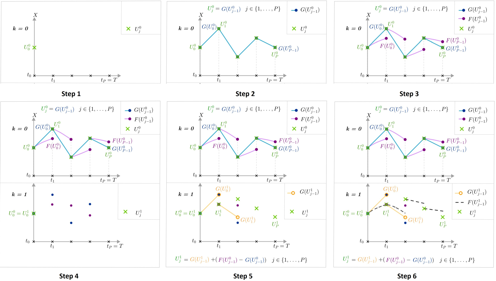

# Data assimilation for the Lorenz system

## Authors

This project is realized by two Master 1 students of the master CSMI : LECOURTIER Frédérique and AYDOGDU Melissa.

It is managed by [Cemosis](http://www.cemosis.fr/) which is the "Centre de Modélisation et de Simulation de Strasbourg" (Strasbourg Modeling and Simulation Center). 

Cemosis is hosted by the Institute of Advanced Mathematical Research (IRMA) and was created in January 2013. 

Cemosis relies currently on the team Modeling and Control of the IRMA. 

Their work is focused on the numarical simulation and mathematical modelling of different phenomena.

## Description of the projet

Main goals of this project :
- Implement a parallel time resolution method for the Lorenz system : the para-real method. Parareal computes the numerical solution for multiple time steps in parallel. It is categorized as a parallel-across-the-steps method. See the following diagramm :

    

- Realize the data assimilation using the EnKF method.

## Compile

### Cmake

Install cmake >= 3.21 using e.g. apt from kitware, snap on ubunty 20.04 or homebrew.

Install from [Kitware APT](https://apt.kitware.com/)

    sudo apt-get update
    sudo apt-get install gpg wget
    echo 'deb [signed-by=/usr/share/keyrings/kitware-archive-keyring.gpg] https://apt.kitware.com/ubuntu/ focal main' | sudo tee /etc/apt/sources.list.d/kitware.list >/dev/null
    sudo apt-get update
    sudo apt install cmake

Install cmake on Ubuntu using snap.

    snap install cmake

Install cmake on homebrew.

    brew install cmake

### Compile

VScode provides an interface for CMake Presets (see `CMakePresets.json`).

Configure and build the `default` preset.

    cmake --preset default
    cmake --build --preset default

